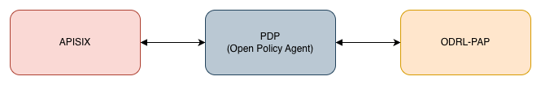

# odrl-authorization
[](https://github.com/FIWARE/catalogue/tree/master/security/README.md)

The FIWARE ODRL Authorization (ODRL-Authorization) is an integrated suite of components designed to facilitate authorization using Verifiable Credentials.

This repository provides a description of the FIWARE Verifiable Credential Authorization and deployment recipes.

This project is part of [FIWARE](https://www.fiware.org/). For more information check the FIWARE Catalogue entry for
[Security](https://github.com/FIWARE/catalogue/tree/master/security).

| :books: [Documentation]()  |  :dart: [Roadmap](https://github.com/FIWARE/odrl-authorization/tree/master/doc/ROADMAP.md)|
|---|---|

<details>
<summary><strong>Table of Contents</strong></summary>

<!-- START doctoc generated TOC please keep comment here to allow auto update -->
<!-- DON'T EDIT THIS SECTION, INSTEAD RE-RUN doctoc TO UPDATE -->


<!-- END doctoc generated TOC please keep comment here to allow auto update -->

</details>

# Overview

FIWARE ODRL Authorization enables management of access authorization to services using an Attribute-Based Access Control (ABAC) model expressed with ODRL policies. In this architecture, ODRL is the policy language for expressing permissions, constraints and obligations; those ODRL policies are translated into executable Rego rules that the Open Policy Agent (OPA) evaluates at runtime.

The goal is to deliver a pluggable, standards-aligned authorization plane that:

* Accepts access requests (including contexts derived from Verifiable Credentials / VPs) at the gateway (APISIX).

* Evaluates requests against ABAC policies authored in ODRL (after translation to Rego).

* Returns enforceable allow/deny decisions that APISIX uses to permit or block traffic

# Release Information
FIWARE ODRL Authorization uses a continious integration flow, where every merge to the main-branch triggers a new release. Versioning follows Semantic Versioning 2.0.0, therefor only major changes will contain breaking changes. Important releases will be listed below, with additional information linked:

# Core components

* [APISIX (Policy Enforcement Point — PEP)](https://apisix.apache.org/): intercepts incoming requests, performs credential/token validation and forwards the authorization query to Open Policy Agent (OPA). APISIX enforces the decision returned by the PDP.

* [Open Policy Agent (Policy Decision Point — PDP - OPA)](https://www.openpolicyagent.org/): evaluates the incoming request context against Rego policies and returns a decision (allow / deny). OPA fetchs policies from ODR-PAP for ABAC evaluation.

* [ODRL-PAP (Policy Administration Point / Translator)](https://github.com/wistefan/odrl-pap): stores and manages ODRL policies (the human/semantic representation) and translates them into Rego policy modules that OPA can execute. It serves as the policy lifecycle manager (create / update / push) for the authorization stack.

<p align="center">

</p>

## Deployment

### Local Deployment

The FIWARE ODRL Authorization provides a minimal local deployment setup intended for development and testing purposes.

The requirements for the local deployment are:
* [Maven](https://maven.apache.org/)
* Java Development Kit (at least v21)
* [Docker](https://www.docker.com/)
* [Helm](https://helm.sh/)
* [Helmfile](https://helmfile.readthedocs.io/en/latest/)

In order to interact with the system, the following tools are also helpful:
- [kubectl](https://kubernetes.io/docs/tasks/tools/install-kubectl/)
- [curl](https://curl.se/download.html)
- [jq](https://stedolan.github.io/jq/download/)
- [yq](https://mikefarah.gitbook.io/yq/)

> :warning: In current Linux installations, ```br_netfilter``` is disabled by default. That leads to networking issues inside the k3s cluster and will prevent the connector to start up properly. Make sure that its enabled via ```modprobe br_netfilter```. See [Stackoverflow](https://stackoverflow.com/questions/48148838/kube-dns-error-reply-from-unexpected-source/48151279#48151279) for more.

To start the deployment, just use:

```shell
    mvn clean deploy -Plocal
```

### Deployment with Helm

The odrl-authorization is a [Helm Umbrella-Chart](https://helm.sh/docs/howto/charts_tips_and_tricks/#complex-charts-with-many-dependencies), containing all the sub-charts of the different components and their dependencies. Its sources can be found[here](./charts/odrl-authorization).

The chart is available at the repository ```https://fiware.github.io/odrl-authorization/```. You can install it via:

```shell
    # add the repo
    helm repo add odrl-authorization https://fiware.github.io/odrl-authorization/
    # install the chart
    helm install <DeploymentName> odrl-authorization/odrl-authorization -n <Namespace> -f values.yaml
```
**Note,** that due to the app-of-apps structure of the deployment and the different dependencies between the components, a deployment without providing any configuration values will not work. Make sure to provide a
`values.yaml` file for the deployment, specifying all necessary parameters. This includes setting parameters of the endpoints, DNS information (providing Ingress or OpenShift Route parameters),
structure and type of the required VCs, internal hostnames of the different components and providing the configuration of the DID and keys/certs.

Configurations for all sub-charts (and sub-dependencies) can be managed through the top-level [values.yaml](./charts/odrl-authorization/values.yaml) of the chart. It contains the default values of each component and additional parameter shared between the components. The configuration of the applications can be changed under the key ```<APPLICATION_NAME>```, please see the individual applications and there sub-charts for the available options.

The chart is [published and released](./github/workflows/release-helm.yaml) on each merge to master.

## Testing

In order to test the [helm-chart](./charts/odrl-authorization) provided for the FIWARE ODRL authorization, an integration-test
framework based on [Cucumber](https://cucumber.io/) and [Junit5](https://junit.org/junit5/) is provided: [it](./it).

The tests can be executed via:
```shell
    mvn clean integration-test -Ptest
```
They will spin up the [Local Deployment](#local-deployment) and run
the [test-scenarios](./it/src/test/resources/it/mvds_basic.feature) against it.

## How to contribute

Please, check the doc [here](doc/CONTRIBUTING.md).

## License
odrl-authorization is licensed under [MIT License](LICENSE).

For the avoidance of doubt, the owners of this software
wish to make a clarifying public statement as follows:

> Please note that software derived as a result of modifying the source code of this
> software in order to fix a bug or incorporate enhancements is considered a derivative
> work of the product. Software that merely uses or aggregates (i.e. links to) an otherwise
> unmodified version of existing software is not considered a derivative work, and therefore
> it does not need to be released as under the same license, or even released as open source.
